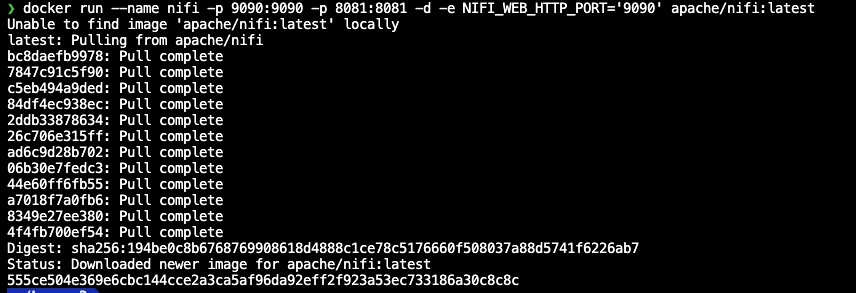
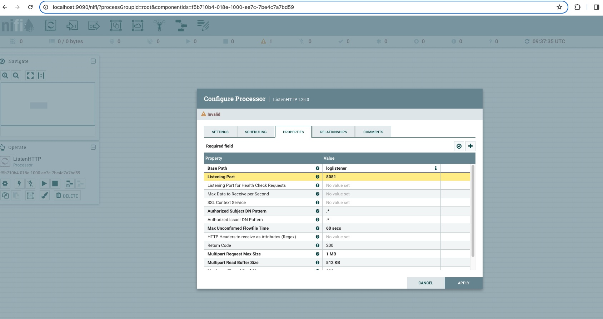
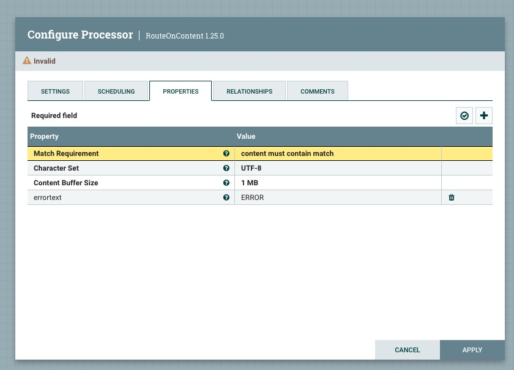
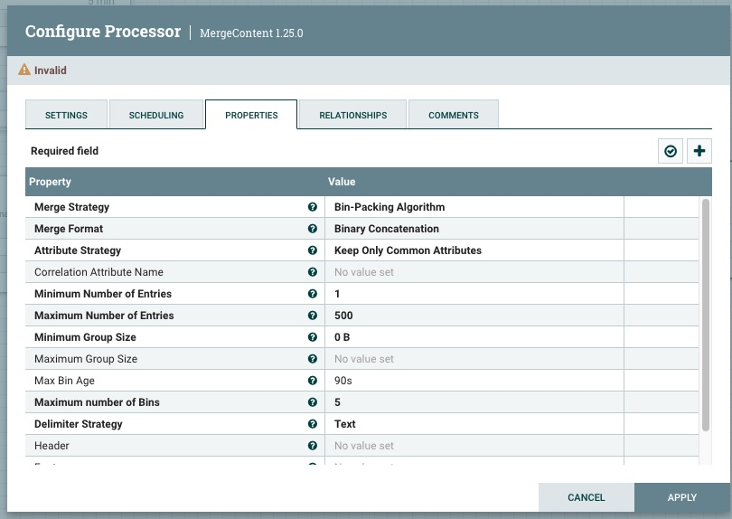
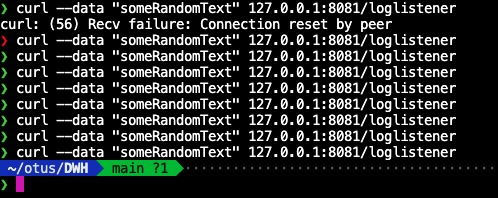
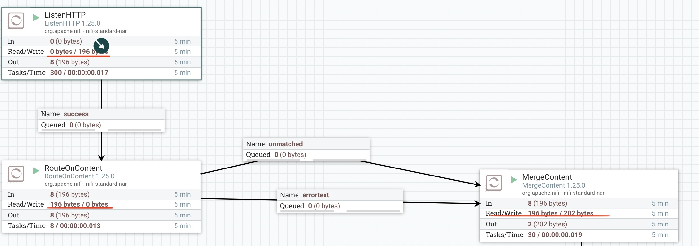
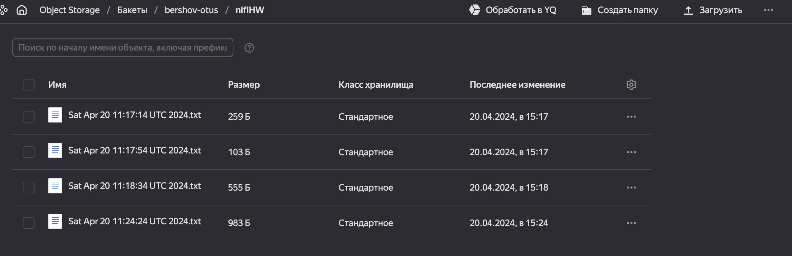
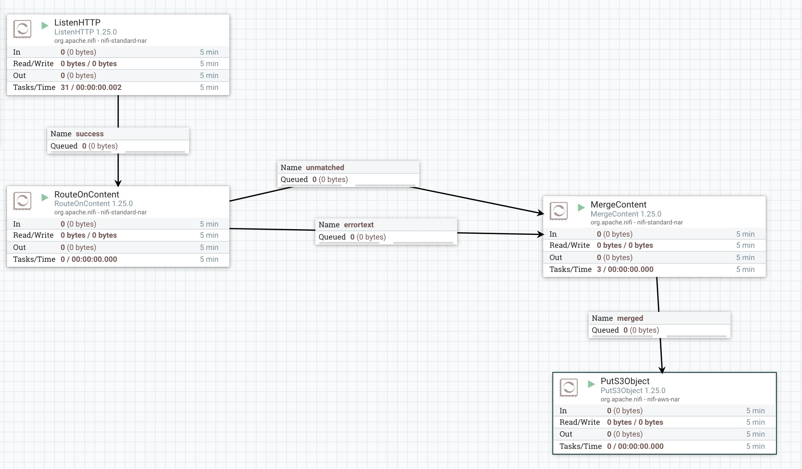
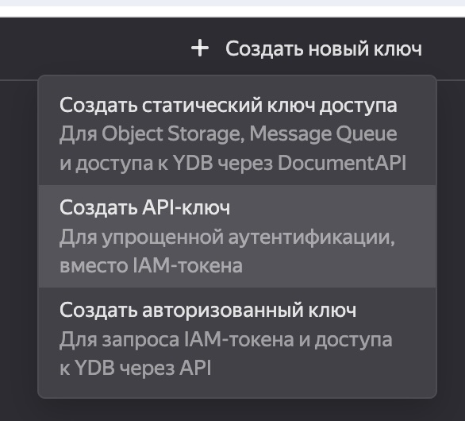

# Инструменты для выгрузки данных

## Установка NiFi через Docker

 

## Конструируем Pipeline

1. Открываем редактор в браузере: http://localhost:9090/, Добавляем следующие процессоры:
2. HTTP Listener 
3. RouteOnContent 
4. MergeContent 
5. Проверяем,  что данные отпраляются в Pipeline
    - 
    - 
6. PutS3Object

### Настраиваем загрузку в Yandex S3

1. Создаем новый bucket: bershov-otus
2. Создаем новый сервисный аккаунт: s3-otus-lab
    - Назначаем ему роль storage.admin
3. Создаем API Keys для сервисного аккаунта s3-otus-lab
    - API Key ID: YCAJEeuiVxX6Mzzj3VsDf3Pb_
    - API Key Secret: ****************************
4. Добавляем процессор PutS3Object
5. Гуглим документацию по NiFi: https://nifi.apache.org/docs/nifi-docs/components/org.apache.nifi/nifi-aws-nar/1.25.0/org.apache.nifi.processors.aws.s3.PutS3Object/index.html
    - Находим нужный нам пункт: **Endpoint URL to use instead of the AWS default including scheme, host, port, and path. The AWS libraries select an endpoint URL based on the AWS region, but this property overrides the selected endpoint URL, allowing use with other S3-compatible endpoints.
Supports Expression Language: true (will be evaluated using variable registry only)**
6. Настраиваем следущие параметры в процессоре
    - ObjectKey: nifiHW/${RouteOnContent.Route}/${now()}.txt
    - bucket: bershov-otus
    - Access Key ID: YCAJEeuiVxX6Mzzj3VsDf3Pb_
    - Secret Access Key: ****************************
    - Endpoint Override URL: https://storage.yandexcloud.net
7. Еще раз отправляем текст в HTTP Listener
8. Смотрим в s3 bucket:
    - 

## Итоговоый pipeline

## Troubleshooting

1. Тип ключа для сервисного аккаунта должнен быть: Статический ключ доступа, на API, как в оригиальном s3
- 