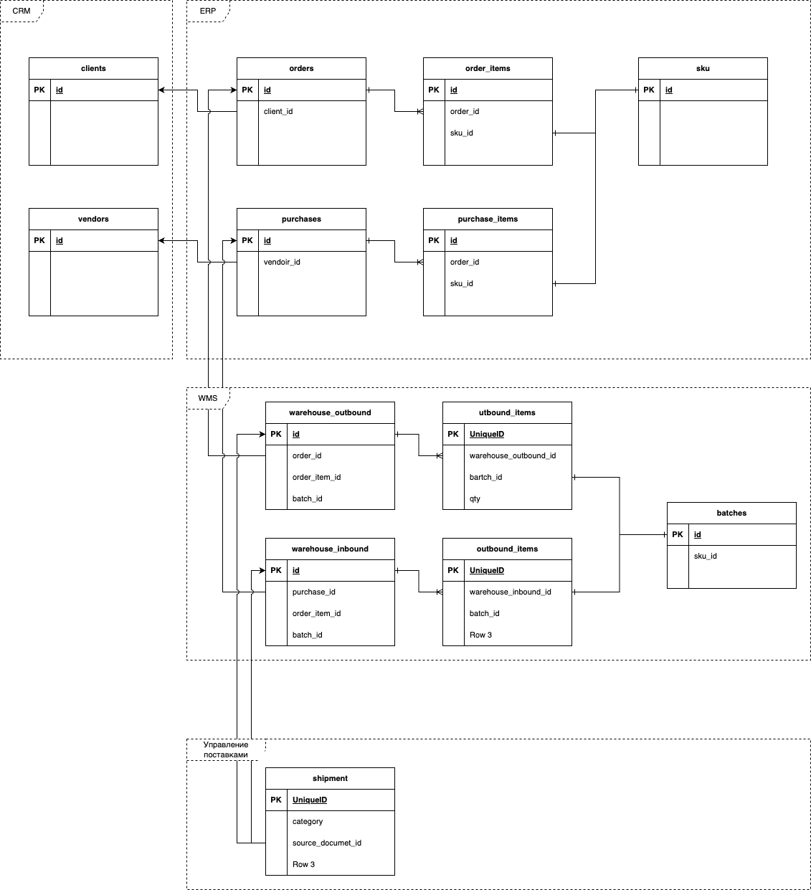
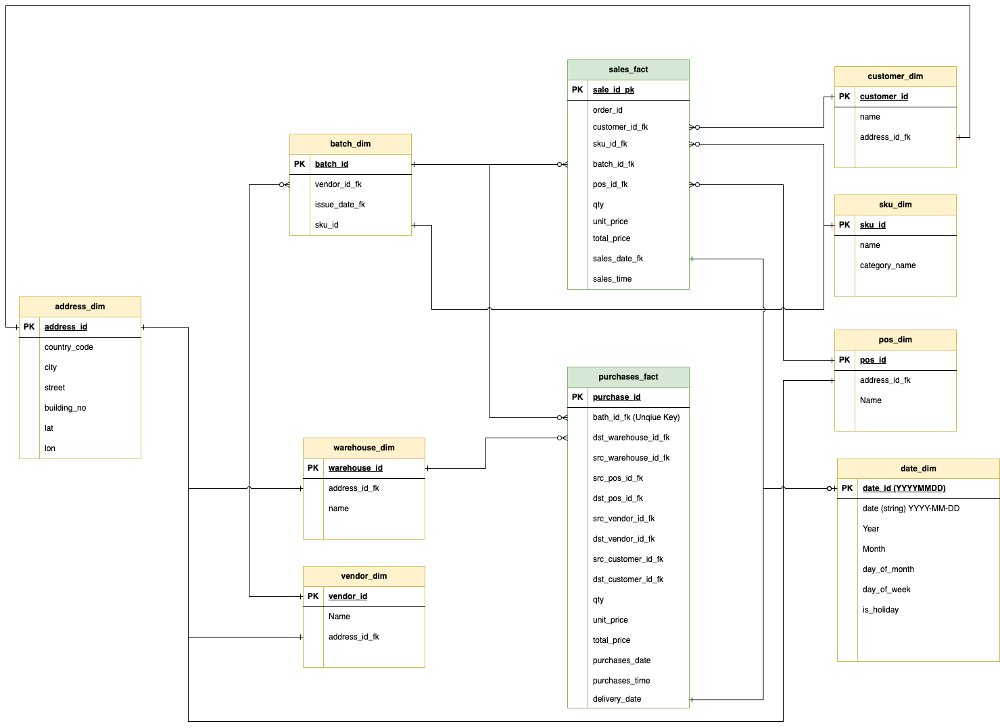

# data warehouse для вымышленной компании, которая занимается продажей электроники. Data warehouse должен содержать данные о продажах, клиентах, продуктах, складах

## Цели создания DWH

1. Консолидация данных
- Требуется объединить данные из различных систем источников в одном месте для обеспечения централизованного доступа к данным о продажах, клиентах, продуктах и складах.
2. Улучшение аналитики и отчетности
- Цель состоит в том, чтобы обеспечить возможность для отдела аналитики и бизнес-аналитиков выполнять сложные запросы и анализировать данные для выявления трендов, отслеживания производительности и генерации бизнес-отчетов.
3. Повышение эффективности управления запасами
- Data Warehouse должен позволить более точно прогнозировать потребности в запасах, анализировать оборачиваемость товаров и оптимизировать операции склада.
4. Улучшение маркетинга и взаимодействия с клиентами
- Сконцентрированные данные о клиентах и продажах должны позволить компании лучше понимать поведение клиентов, улучшать таргетинг рекламных кампаний и персонализировать предложения.
5. Обеспечение надежного и безопасного хранения данных
- Data Warehouse должен обеспечивать надежное хранение данных с резервным копированием и соблюдением нормативных требований к защите данных.

## Источники данных

1. ERP - продажа из POS (point of sales)
2. WMS - Система управления складом  (warehouse management system)
3. CRM - Система управления клиентами
4. Система управления доставками

## Бизнес требования:
- Расчет прибыль от продаж клиенту за заданный период
- Расчет количество товаров проданных клиентам за заданный период
- Расчет прибыльность продаж товара, как разницу между ценой закупки и продажи, за заданный период
- Расчет количество возвратов поставщику или в торговую точку товаров за определенной период
- Отслеживалось перемещений партий

### Основные процессы компании

1. Закупка у поставщика
2. Доставка на склад
3. Перемещение со склада в торговую точку
4. Продажа
5. Доставка клиенту

## Staging layer

- Сбор и временное хранение данных из разных источников перед дальнейшей обработкой. Данные представлены AS IS, с минимальными преобразованиями. 

- Клиенты делают заказы, которые отражены в ERP
    - База клиентов хранится в CRM
- Компания закупает продукцию у вендоров, закупки отражены в ERP
    - База поставщиков хранится в CRM
    - Продукты поступают на склад партиями от поставщиков
- Заказы собираются на складе из партий
- Доставки товаров и отправка клиентов ведется в системе поставок

## ODS Layer

- Предоставляет доступ к "оперативным" данным, которые могут использоваться для отчетов и аналитики в реальном времени или почти в реальном времени.

## DDS layer

-  Хранение данных, подготовленных для аналитических целей. Этот слой содержит очищенные, согласованные и структурированные данные.

### sales_fact (Факты продажи)
 
 - Продажа товара клиенту
 - Гранулярность: Продажа, Товар, Заказ, Партия товара, торговая точка, дата и время продажи

|Поле|Тип|Описание|
|----|---|--------|
|sale_id_pk|string|Суррогатный PK, HASH(order_no,client_no,sku_name)
|order_id_fk|string|Код заказа из ERP|
|customer_id_fk|string|Ссылка на измерение клиента|
|sku_id_fk|string|Ссылка на описание товара|
|batch_id_fk|string|Ссылка на описание партии|
|pos_id|string|Ссылка на профиль торговой точки|
|Qty|integer|Количество единиц товара из партии|
|unit_price|Number|Стоимость единицы товара из партии|
|total_price|Number|Итого|
|sales_date_fk|Ссылка на измерение даты|Дата продажи|
|sales_time|integer |Время продажи(unix timestamp)|

- дополнительно требуется контроль целостсности данных: код товара в продаже и код товара в партии должны совпадать

### customer_dim

 - Измерение клиента

|Поле|Тип|Описание|
|----|---|--------|
|Customer_id_pk|string|код клиента|
|Name|string|Имя клиента|
|address_id_fk|Ссылка на адрес|Адрес торговой точки|

### pos_dim
 
 - Измерение point of sales (Торговая точка)

|Поле|Тип|Описание|
|----|---|--------|
|pos_id_pk|string|Код торговой точки|
|name|string|Название торговой точки|
|address_id_fk|Ссылка на адрес|Адрес торговой точки|

### purchase_fact 

- Факт закупки у поставщика
- Гранулярность: Поставщик, товар, партия, код склада назначения, дата закупки

|Поле|Тип|Описание|
|----|---|--------|
|purchase_id_pk|string|код закупки|
|batch_id_fk|string|ссылка на измерение партии|
|dst_warehouse_id|string|Ссылка на измерение склада|
|Qty|string|Количество товара в партии|
|unit_price|number|закупочная цена единицы товара|
|total|number|итоговая стоимость закупки|
|purchase_date_fk|Ссылка на измерение даты|Дата закупки|
|purchase_time|integer|Время закупки|
|delivery_date_fk|Ссылка на измерение даты|Дата поставки на склад|

### vendor_dim

 - Измерение вендора

|Поле|Тип|Описание|
|----|---|--------|
|vendor_id_pk|string|Код поставщика|
|name|string|Название поставщика|
|address_id_fk|string|Ссылка на измерение адреса, адрес поставщика, для простоты ДЗ будем считать, что адрес завода изготовителя|

### warehouse_dim

 - Измерение склада

|Поле|Тип|Описание|
|----|---|--------|
|warehouse_id|string|ссылка на код измерение поставщика|
|name|string|Название склада|
|address_id_fk|string|Ссылка на измерение адреса, адрес склада|

### shipment_fact

- Поставка (Доставка) товаров
- Гранулярность: Адрес источник, Адрес получателя, товар, Пратия, тип поставки(доставки)
- Категории поставок(доставок)
    - VENDOR_WAREHOUSE
    - WAREHOUSE_POS
    - POS_WAREHOUSE
    - POS_CLIENT
    - CLIENT_POS (Возврат)
    - POS_POS
    - POS_VENDOR (Возврат поставщику)
    - WAREHOUSE_VENDOR (Возврат поставщику)

|Поле|Тип|Описание|
|----|---|--------|
|shipment_id|string|Код постаки|
|shipment_category|string|Категория доставки|
|src_address_id_fk|string|Категория адрес отправителя|
|src_address_id_fk|string|Категория адрес получателя|
|batch_id|ссылка на категорию партий|Партия товара|
|qty|integer|количество товаров в партии|
|src_vednor_id_fk|||
|dst_vednor_id_fk|||
|src_warehouse_id|||
|dst_warehouse_id|||
|scr_pos_id|||
|dst_pos_id|||
|src_client_id|||
|dst_client_id|||

Далее общие измерения: 

### address_dim
 
 - Измерение адреса

|Поле|Тип|Описание|
|----|---|--------|
|address_id_pk|string|код адреса|
|city|string|город|
|country_code|string|код страны|
|street|string|Улица|
|building_no|string|Номер строения/корпус|
|lat|Number|Географическая широта|
|lon|Number|Географическая долгота|

### sku_dim

 - Измерение товар

|Поле|Тип|Описание|
|----|---|--------|
|sku_id_pk|string|Код товара|
|name|string|Название товара|
|category_name|string|Название категории товара|

### batch_dim

 - Измерение партии товра

 |Поле|Тип|Описание|
|----|---|--------|
|batch_id|string|Код партии|
|vendor_id_fk|string|Ссылка на измерение вендора|
|sku_id|string|Ссылка на измерение товар|

## Datamart

- Служит конечной точкой для конечных пользователей, предоставляя специализированные представления данных для различных отделов или функций.

