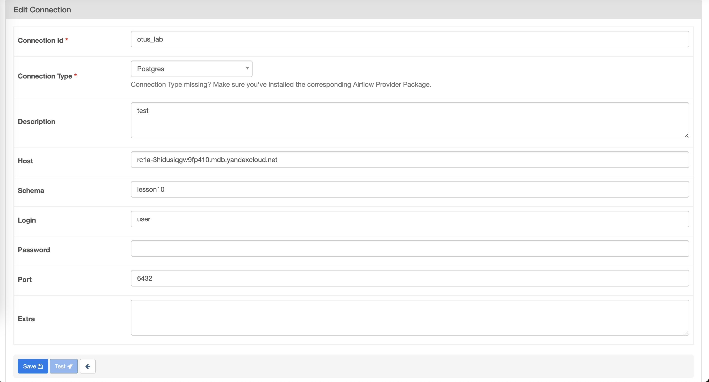
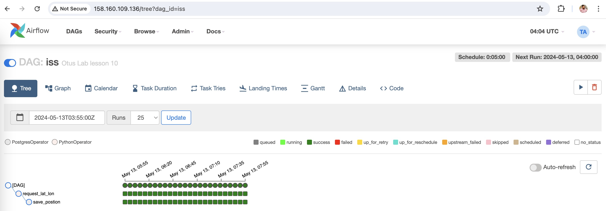
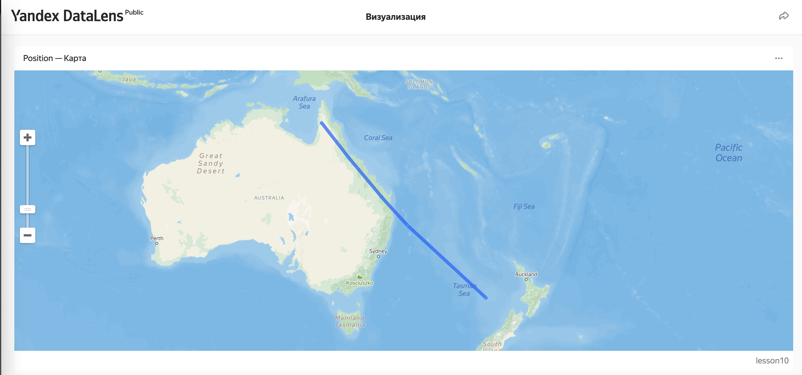
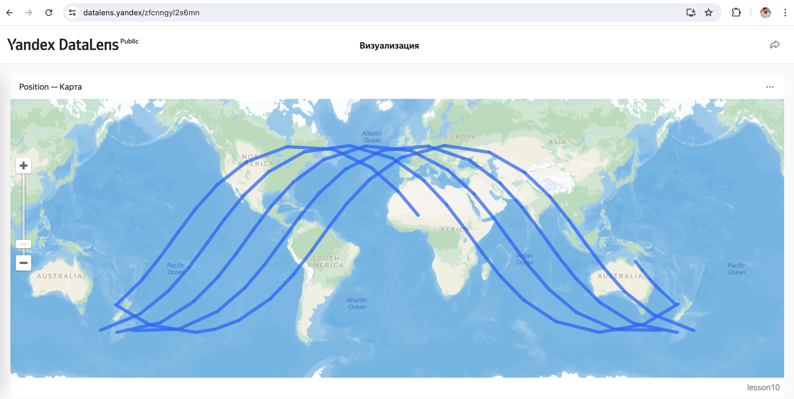

# 

## Настройка 

1. Готовим контейнер с terraform и yc для развертывания инфраструктуры в облаке
 - lesson10/terraform инфраструктура
 - Dockerfile утилиты для codespace

```
export YC_TOKEN=$(yc iam create-token)
export YC_CLOUD_ID=$(yc config get cloud-id)
export YC_FOLDER_ID=$(yc config get folder-id)
export $(xargs <.env)
```

## Инфраструктура

1. Подсети
	- otus-lab-subnet-a
	- otus-lab-subnet-b
2. Группы безопасности и правила

|Группа|Назначение|Тип|Protocol|PORT|CIDR/SG|
|------|----------|---|--------|----|-------|
|db-sg|Группа для поключения к БД из airflow vm|ingress|TCP|6432|airflow-sg|
|db-sg|Группа для поключения к БД из datalens|ingress|TCP|6432|Список CIDR из документации к datalens|
|db-sg|Группа для диагностики доступности хоста их VM Airflow|ingress|ICMP|6432|airflow-sg|
|airflow-sg|Группа для доступа к dashboard airflow из интенрета|ingress|TCP|80|0.0.0.0/0|
|airflow-sg|Группа для доступа к ssh airflow из интенрета|ingress|TCP|22|0.0.0.0/0|
|airflow-sg|Группа для доступа из airflow к источнику данных|eggress|TCP|80|138.68.39.196/32|

3. Managed сервисы в облаке

|Сервис|Подсеть|Группа безопаснтсти|
|------|----------|---|
|airflow-vm|otus-lab-subnet-a|airflow-sg|
|PostgreSQL|otus-lab-subnet-b|db-sg|

## Структура БД

1. Подключаемся к БД из bach airflow VM: psql -h rc1a-3hidusiqgw9fp410.mdb.yandexcloud.net -p 6432 -U user lesson10
2. Создаем таблицу для хранения результатов
 ```
CREATE TABLE public.iss (
	ts timestamp NOT NULL,
	lat float8 NOT NULL,
	lon float8 NOT NULL,
	CONSTRAINT iss_pk PRIMARY KEY (ts)
);
 ```


## DAG

1. Настраиваем подключение к БД из Airflow в разделе connecitions



2. Создаем DAG: lesson10/dags/iss.py

### Задача 1

```
def request_lat_lon(): 
	r = requests.get('http://api.open-notify.org/iss-now.json')
	return r.json()

get_position = PythonOperator(
	task_id='request_lat_lon',
	python_callable= request_lat_lon,
	dag=dag
)
```

### Задача 2

```
save_postion = PostgresOperator(
    task_id="save_postion",
    postgres_conn_id="otus_lab",
    sql="""
        begin;
        insert into iss(ts, lat, lon) values (
            TO_TIMESTAMP({{ ti.xcom_pull(task_ids='request_lat_lon', key='return_value')['timestamp'] }}), 
            {{ ti.xcom_pull(task_ids='request_lat_lon', key='return_value')['iss_position']['latitude'] }}, 
            {{ ti.xcom_pull(task_ids='request_lat_lon', key='return_value')['iss_position']['longitude'] }}
            );
        commit;
        """,
    dag=dag
)
```

Сохраняем файл iss.py в папку /home/airflow/dags, затем открываем airflow dashboard и проверяем как исполняется DAG:




Проверяем результат подключаясь из BASH airflow vm к БД:

```
	lesson10=> select * from iss;
         ts          |   lat   |   lon   
---------------------+---------+---------
 2024-05-12 22:58:52 | 39.5527 | 0.7215
 2024-05-12 22:59:50 |  41.696 | 4.5006
 2024-05-12 23:00:02 | 42.1428 | 5.3570
 2024-05-12 23:03:26 | 48.2413 | 21.2233
(4 rows)
```

## Визуализация

1. Даем доступ к Datalens из БД
2. Создаем dataset из таблицы iss
3. Создаем chart из dataset
	- Источник данных: таблицы iss
	- Тип: Полилинии GEOPOINT([lat],[lon])
	- Порядок: ts
4. Открываем публичный доступ: https://datalens.yandex/zfcnngyl2s6mn



К утру следующего дня:

