# Dagster QuickStart

Репозиторий: https://github.com/WWTLF/otus_dwh_11/tree/main


1. Клонируем резпозиторий,  и перезаливаем его в свой с домашней работой
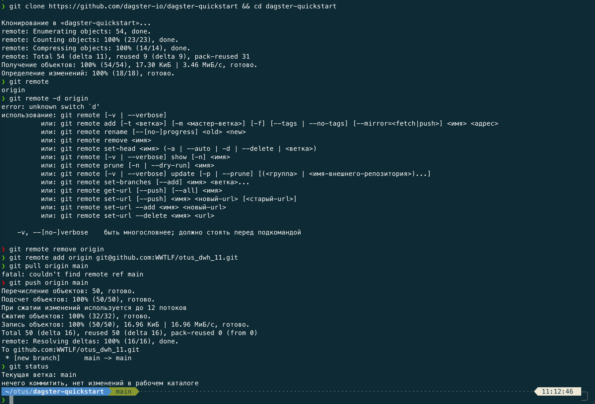

2. Пытаемся настроить оркужение Python
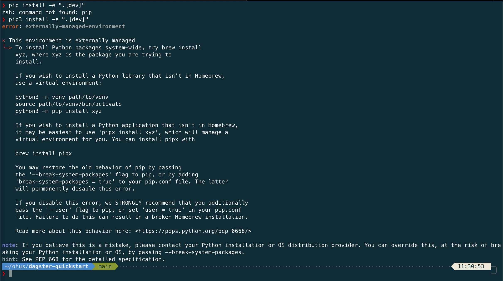

3. Гуглим, находим решение, устраняем проблему с окружением Python.

```
export PIP_BREAK_SYSTEM_PACKAGES=1
```

Повторяем и получаем установленный dagster
```
dagster dev
```
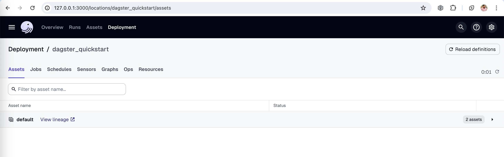

4. Исследуем UI согласно инструкции

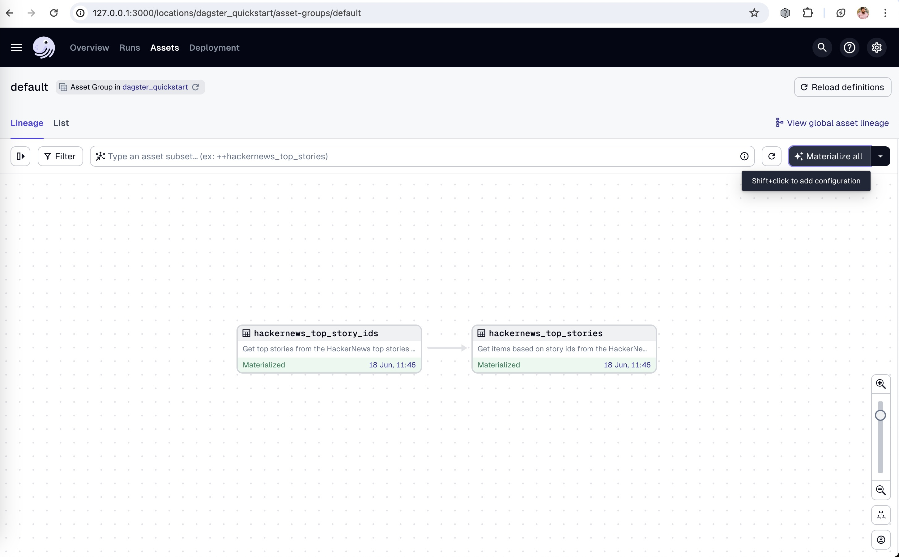
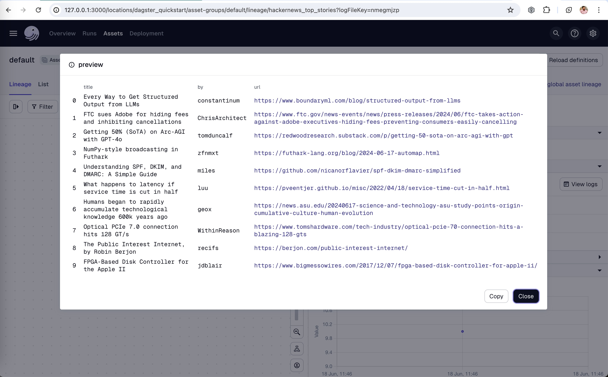


# dugster-dbt

Приступаем ко второй части, установка dugster-dbt

Устанавливаем необходимые питоновские зависимости

```
pip3 install dagster-dbt dagster-webserver dbt-duckdb
```

## Step 1: Download the sample dbt project

1. Клонируем проект

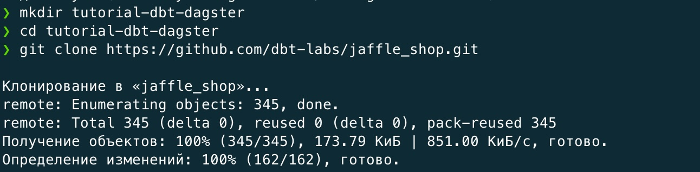

## Step 2: Configure your dbt project to run with DuckDB

1. Согласно инструкции создаем файл:  https://github.com/WWTLF/otus_dwh_11/blob/main/tutorial-dbt-dagster/jaffle_shop/profiles.yml


## Step 3: Build your dbt project

1. Проверяем работает ли  dbt
```
dbt build
```

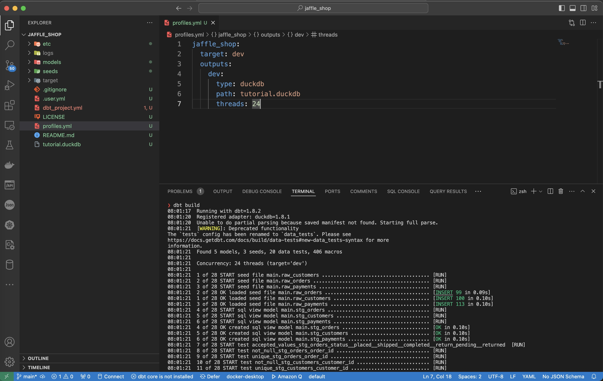

## Step 4: Create a Dagster project that wraps your dbt project

1. Создаем каркас проекта в корне нашего репозитория

```
dagster-dbt project scaffold --project-name jaffle_dagster
```

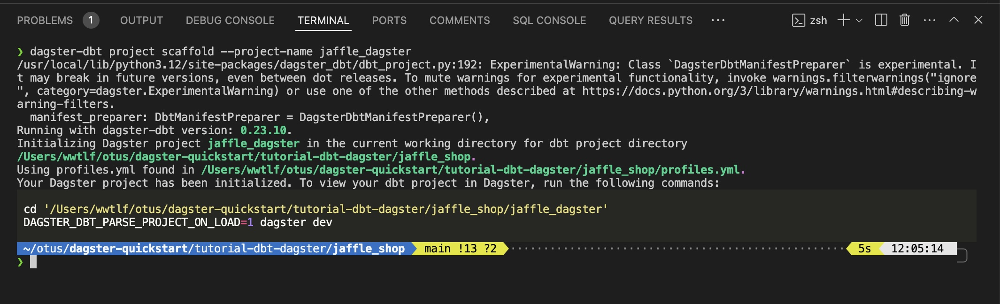


## Step 5: Inspect your Dagster project in Dagster's UI

1. Запускаем UI, материализуем наши модели
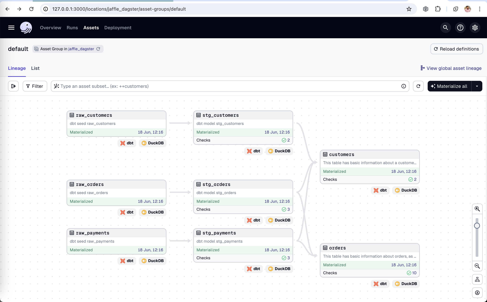
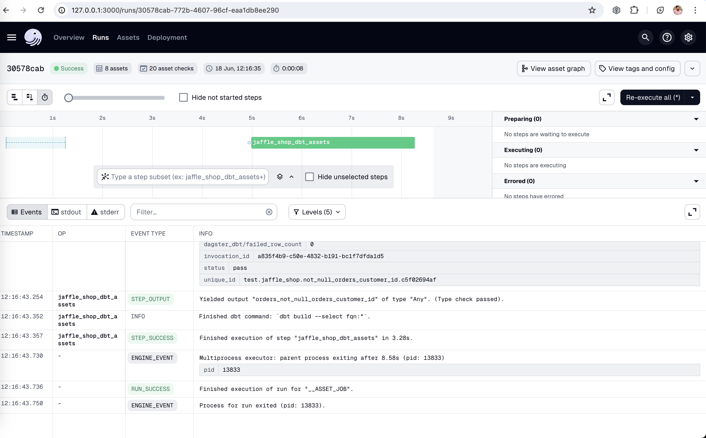

## Step 6: Install the Pandas and DuckDB Python libraries

1. Устанавлиаем дополнительные зависимости для использования asset как upstream для DBT модели

```
pip3 install pandas duckdb pyarrow
```
2. Создаем новый asset raw_customers в файле: https://github.com/WWTLF/otus_dwh_11/blob/main/tutorial-dbt-dagster/jaffle_shop/jaffle_dagster/jaffle_dagster/assets.py

3. Включаем его в файл: https://github.com/WWTLF/otus_dwh_11/blob/main/tutorial-dbt-dagster/jaffle_shop/jaffle_dagster/jaffle_dagster/definitions.py

4. Определяем его как источник данных в файле: https://github.com/WWTLF/otus_dwh_11/blob/main/tutorial-dbt-dagster/jaffle_shop/models/sources.yml

## Step 7: Materialize the assets using the Dagster UI

1. Запускаем UI, материализуем наши модели, видим новый asset raw_customers определенный как Python

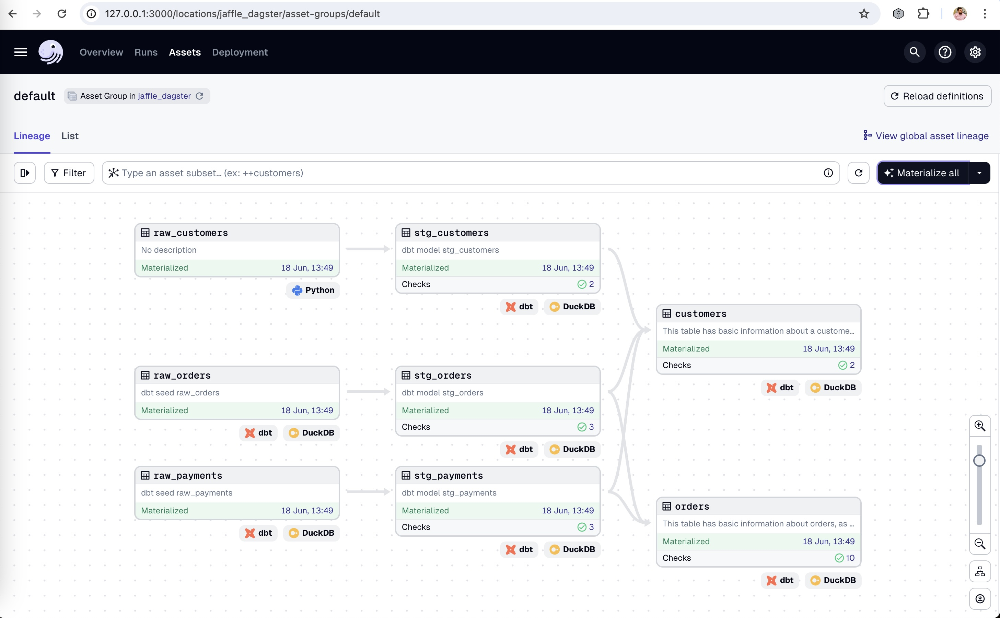


## Step 8. Using dbt with Dagster, part four: Add a downstream asset

1. Доставляем зависиомсти

```
pip3 install plotly
```

2. Создаем новый asset order_count_chart в файле: https://github.com/WWTLF/otus_dwh_11/blob/main/tutorial-dbt-dagster/jaffle_shop/jaffle_dagster/jaffle_dagster/assets.py

3. Включаем его в файл: https://github.com/WWTLF/otus_dwh_11/blob/main/tutorial-dbt-dagster/jaffle_shop/jaffle_dagster/jaffle_dagster/definitions.py

Step 9: Materialize the order_count_chart asset

1. Запускаем dagster, видим order_count_chart определенный как Python
2. Материализуем все ассеты

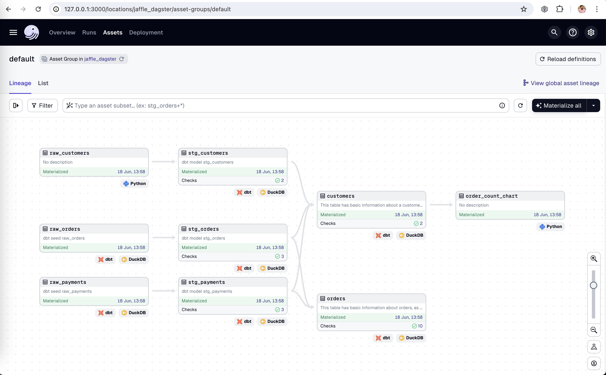

3. Получаем в отдельной вкалдке график.

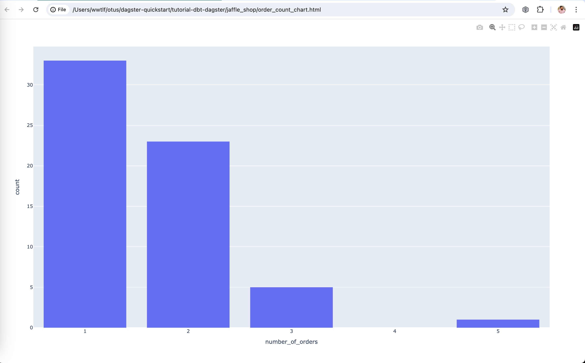


# Выводы

1. В ходе данной работы был установлен dbt, в него был добавлен проект dustger, ассеты которого могут выступать в роли источника или приемника данных для моделей dbt. 
2. Ассет источник данных выполняет SQL запрос в DuckDB на вставку данных из Pandas DataFrame. Но это фича DuckDB, а не Dugster.
3. Ассет приемник данных выполняет SQL запрос в DuckDB, результатат сохраняет в DataFrame, из кторого уже можно строить графики и проводить другие операции над DataFrame. 