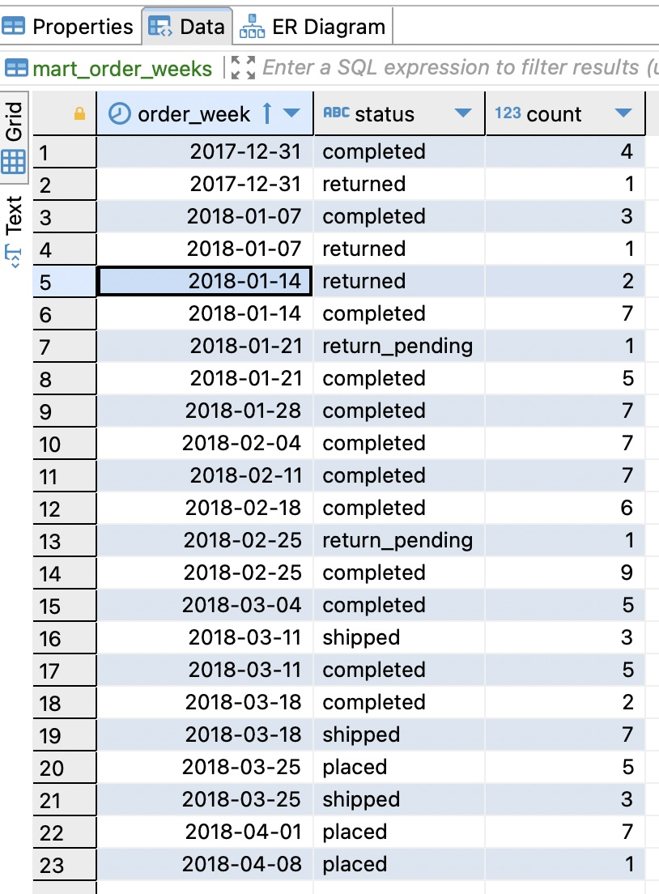
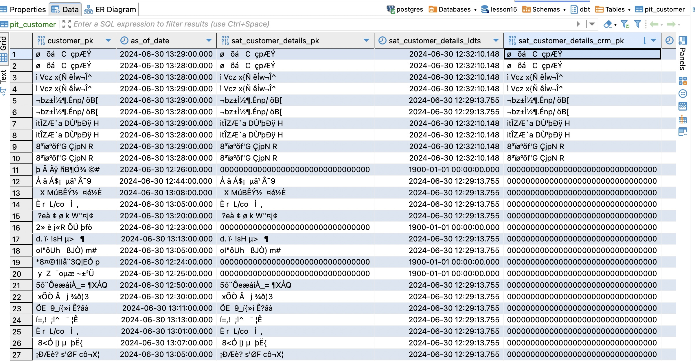
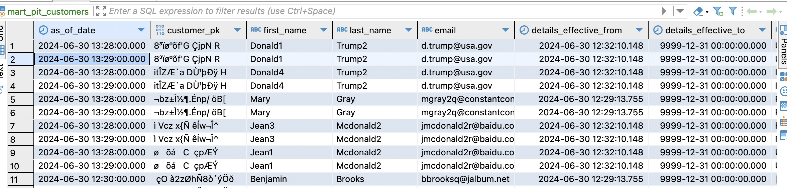

# Data Vault – 2. Моделирование данных в Хранилище (с использованием Data Vault и dbt)

## Форк репозитрия

Форкнутый репозиторий: https://github.com/WWTLF/otus_dwh_15

## Вопросы

### Построение витрины данных над Data Vault

Исходный код витрины: https://github.com/WWTLF/otus_dwh_15/blob/main/models/marts/mart_order_weeks.sql

```sql
{{
    config(
        enabled=True,
        materialized='table'
    )
}}

with source as (
    SELECT 
        hub_order.order_pk,
        sat_order_details.status,       
        {{ dbt_date.week_start(" sat_order_details.order_date") }} as order_week
     from {{ ref("hub_order") }} as hub_order
     left join {{ ref("sat_order_details") }} as sat_order_details on hub_order.order_pk = sat_order_details.order_pk
)

SELECT 
    order_week,    
    status,
    count(order_week)

    from source group by order_week, status
```

Скриншот: 


### Изменения атрибутного состава клиентов

1. Добавляем as_of_date модель: https://github.com/WWTLF/otus_dwh_15/blob/main/models/business_vault/pits/as_of_date.sql
    - Так все изменения происходили в пределах одного дня, то выбираем гранулярность 1 минута для наглядности
    - Данная модель создает таблицу со списком дат в указанном диапазоне

```sql
{{ config(materialized='table') }}





WITH as_of_date AS (
    {{ dbt_utils.date_spine(datepart=datepart, 
                            start_date=start_date,
                            end_date=end_date) }}
)

SELECT DATE_{{datepart}} as AS_OF_DATE FROM as_of_date
```

2. Создаем PIT таблицу: https://github.com/WWTLF/otus_dwh_15/blob/main/models/business_vault/pits/pit_customer.sql
    - Туда добавлен стелит из дополнительного задания

```sql
{{ config(materialized='pit_incremental') }}


source_model: hub_customer
src_pk: CUSTOMER_PK
as_of_dates_table: as_of_date
satellites: 
  sat_customer_details:
    pk:
      PK: CUSTOMER_PK
    ldts:
      LDTS: LOAD_DATE
  sat_customer_details_crm:
    pk:
      PK: CUSTOMER_PK
    ldts:
      LDTS: LOAD_DATE
stage_tables: 
  sat_customer_details: LOAD_DATE 
src_ldts: LOAD_DATE











{{ automate_dv.pit(source_model=source_model, src_pk=src_pk,
                   as_of_dates_table=as_of_dates_table,
                   satellites=satellites,
                   stage_tables_ldts=stage_tables_ldts,
                   src_ldts=src_ldts) }}
```

3. Сама таблица содержит только ключ хаба customers, и даты загрузок в сателлиты, ей нужна еще одна витрина: 
 

4. Создаем витрину для PIT таблицы: https://github.com/WWTLF/otus_dwh_15/blob/main/models/marts/mart_pit_customers.sql
    - К ней джим сателлиты по ключу клиента и датам загрузки
    - Также добавляем поля актуальности данных сателлитов (от и до), для каждого сателлита, а для этого сначала создаем CTE для каждого сателлита и окнной функцией LEAD узнаем дату окончания действия. Функция LEAD берет значение этого же поля, следующее по порядку в указанной партиции

```sql
with customer_effective_to as (
    select 
        sat_customer_details.customer_pk,
        sat_customer_details.load_date,
        sat_customer_details.first_name,
        sat_customer_details.last_name,
        sat_customer_details.email,
        sat_customer_details.effective_from,
        lead(sat_customer_details.effective_from, 1, date '9999-12-31') over(partition by sat_customer_details.customer_pk order by sat_customer_details.effective_from) as effective_to
    from  {{ref('sat_customer_details')}} as sat_customer_details
),
customer_effective_crm_to as (
    select 
        sat_customer_details_crm.customer_pk,
        sat_customer_details_crm.load_date,
        sat_customer_details_crm.country,
        sat_customer_details_crm.age,        
        sat_customer_details_crm.effective_from,
        lead(
        sat_customer_details_crm.effective_from, 
        1, date '9999-12-31')
         over(partition by sat_customer_details_crm.customer_pk 
         order by sat_customer_details_crm.effective_from) as effective_to
    from  {{ref('sat_customer_details_crm')}} as sat_customer_details_crm
)


select 
    pcd.as_of_date,
    pcd.customer_pk,
    cft.first_name,
    cft.last_name,
    cft.email,
    cft.effective_from as details_effective_from,
    cft.effective_to as details_effective_to,
    cftm.country,
    cftm.age,
    cftm.effective_from as crm_effective_from,
    cftm.effective_to as crm_effective_to

from 
    {{ref('pit_customer')}} as pcd 
    left join customer_effective_to as cft on 
        pcd.sat_customer_details_pk = cft.customer_pk
        and  pcd.sat_customer_details_ldts = cft.load_date
    left join customer_effective_crm_to as cftm 
        on pcd.sat_customer_details_crm_pk = cftm.customer_pk
         and  pcd.sat_customer_details_crm_ldts = cftm.load_date
order by 
    pcd.customer_pk,
    pcd.as_of_date
```



Если на as_of_date, данных в сателлите нет, то отображатся NULLы, так как данные были загружены (effective_from) после времени в as_of_date


5. Добавлен новый источник, и к нему сателлит source_customers_crm.csv(https://github.com/WWTLF/otus_dwh_15/blob/main/models/stage/v_stg_customers_crm.sql), также он включен в PIT таблицу

Источник:
```sql
{{
    config(
        enabled=True
    )
}}


source_model: 'source_customers_crm'
derived_columns:
  CUSTOMER_KEY: 'id'
  RECORD_SOURCE: '!CSV_CUSTOMERS_CRM'
hashed_columns:
  CUSTOMER_PK: 'id'
  CRM_HASHDIFF:
    is_hashdiff: true
    columns:
      - 'country'
      - 'age'      











WITH staging AS (
{{ automate_dv.stage(include_source_columns=true,
                  source_model=source_model,
                  derived_columns=derived_columns,
                  hashed_columns=hashed_columns,
                  ranked_columns=none) }}
)

SELECT *, 
       {{ var('load_date') }}::timestamp AS LOAD_DATE,
       {{ var('load_date') }}::timestamp AS EFFECTIVE_FROM
FROM staging
```


Сателлит https://github.com/WWTLF/otus_dwh_15/blob/main/models/raw_vault/sats/sat_customer_details_crm.sql:
```sql
{{
    config(
        enabled=True
    )
}}









{{ automate_dv.sat(src_pk=src_pk, src_hashdiff=src_hashdiff,
                src_payload=src_payload, src_eff=src_eff,
                src_ldts=src_ldts, src_source=src_source,
                source_model=source_model) }}
```


SQL Дамп приложен
