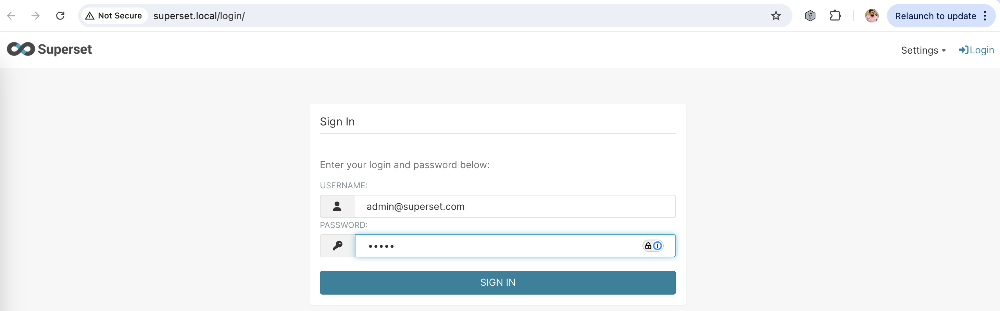

# Создание метрик и дашбордов

## Apache Supetset

### Установка

Рассмаотрим установку self-hosted Apache Superset. Для этого:

1. Выбираем self-hosted установку в kubernates кластер с помощью helm
    - Находим официальный helm chart: https://artifacthub.io/packages/helm/superset/superset
2. Ознакамливаемся с официальной документацией по Superset: https://superset.apache.org/docs/configuration/configuring-superset/
3. Готовим файл для helm чарта: values.yaml
    - Генерируем секрет:
```bash
❯ python3 -c "import secrets; import string; print(''.join(secrets.choice(string.ascii_letters + string.digits) for _ in range(128)))"

EqYrSdgEJgNkeW2bXk9qBjCvr03nQipgKHqq2HQzzgyH5NPluxId6yWWWoZQlcinC6IdVd5MaVB7rpGlaikIVRqSaBV3swiyJHkDtWNyzXGShdc2EgM9CNneceC234AT
```

4. Устанавливаем helm


```bash
❯ helm install my-superset superset/superset -f values.yaml   
```
5. Открываем


### Настройка подключения к источнику данных

1. Используем БД из этого же класстера
2. 

### Создаем Dataset и грфик

1. Для примера строим историю цены BTC
2. Создаем Dataset 
3. Настраиваем график 
4. Создаем Dashboard 

## Выводы

1. Установки cloud и self-managment имеют свои плюсы и минусы. В данном случае установка в self-hosted k8s cluster позволила легко подключиться к источнику данных, который находится в той же физической сети. 
2. BI-решения позволяют строить аналитические запросы и агрегации над данными из источников. 
